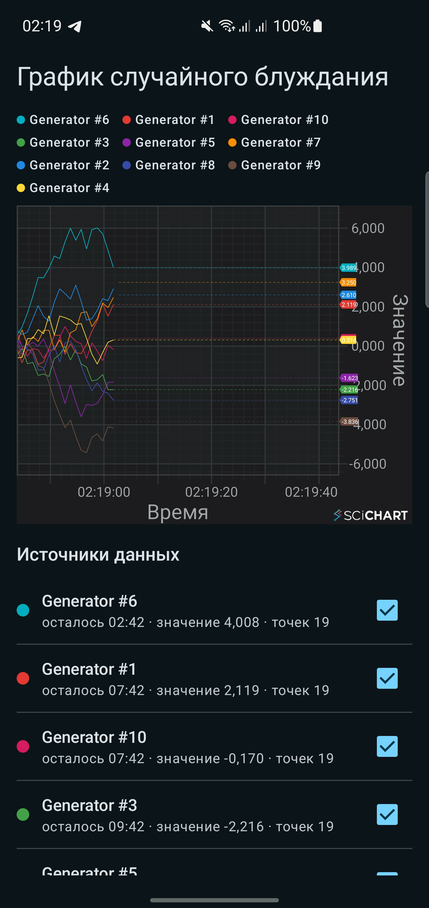
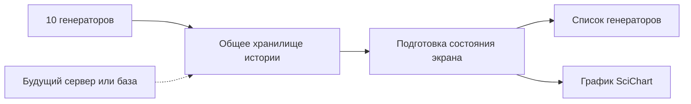

# Тестовое задание SciChart для Android

Одноэкранное Android-приложение с десятью независимыми генераторами значений, списком их
состояний и потоковым графиком SciChart. Реализация закрывает все семь пунктов тестового задания.

## Демонстрация

[](docs/demo/scichart-demo-samsung.mp4)

[Смотреть короткое видео на Samsung SM-G975F](docs/demo/scichart-demo-samsung.mp4)

В записи показаны живое поступление точек, обновление значений и таймеров, переключение линий,
ручное перемещение графика и прокрутка списка генераторов. Видео снято с обычной сборки, в которой
новая точка создаётся раз в секунду.

## Быстрый запуск

Понадобятся:

- Android Studio с поддержкой AGP 9.3;
- JDK 17;
- Android SDK 37;
- устройство или эмулятор с Android 7.0 (API 24) или новее;
- trial-ключ SciChart Android.

Добавьте ключ в локальный `local.properties`:

```properties
SCICHART_LICENSE_KEY=your_trial_key
```

Файл `local.properties` не попадает в Git. Для CI ключ можно передать через переменную окружения
`SCICHART_LICENSE_KEY`. Без ключа приложение не падает: вместо графика отображается понятная
инструкция, а список генераторов продолжает работать.

Сборка и основные проверки:

```bash
./gradlew testDebugUnitTest assembleDebug lintDebug
./gradlew :app:connectedDebugAndroidTest
```

Проверка производительности на подключённом физическом устройстве:

```bash
./gradlew :macrobenchmark:connectedBenchmarkAndroidTest
```

## Соответствие требованиям задания

### 1. Создание проекта и подключение SciChart

Что сделано:

- создано Android-приложение на Kotlin и Jetpack Compose;
- подключены необходимые части SciChart: построение графика, работа с данными и отрисовка;
- trial-ключ вынесен из исходного кода и не сохраняется в репозитории;
- при отсутствии ключа приложение показывает сообщение вместо аварийного завершения.

Где находится:

- зависимости и чтение ключа: [`app/build.gradle.kts`](app/build.gradle.kts);
- применение лицензии при запуске: [`SciChartApplication.kt`](app/src/main/java/com/snn/scichart/SciChartApplication.kt);
- пример локальной настройки: [`local.properties.example`](local.properties.example).

Как проверить: добавить ключ в `local.properties`, собрать и запустить модуль `app`.

### 2. Один экран с графиком и списком генераторов

Что сделано:

- приложение содержит один основной экран;
- экран разделён на график и список генераторов;
- в портретной ориентации области находятся друг под другом;
- в альбомной ориентации области располагаются рядом, чтобы использовать доступную ширину.

Где находится:

- запуск экрана: [`MainActivity.kt`](app/src/main/java/com/snn/scichart/MainActivity.kt);
- расположение элементов: [`ChartScreen.kt`](app/src/main/java/com/snn/scichart/ui/chart/ChartScreen.kt).

Как проверить: повернуть устройство — данные и выбранная видимость линий сохраняются, меняется
только расположение областей.

### 3. Список генераторов

Что сделано:

- при запуске создаются ровно 10 генераторов;
- каждому назначаются уникальные имя и цвет;
- начальное значение выбирается случайно от `-1` до `1`;
- время работы выбирается случайно от 1 до 30 минут;
- список автоматически сортируется по оставшемуся времени от меньшего к большему;
- каждая строка показывает цвет, имя, обратный отсчёт, текущее значение, количество точек и статус;
- после окончания времени генератор помечается как завершённый;
- все линии изначально включены;
- чекбокс сразу скрывает или возвращает соответствующую линию и её отметку значения;
- выбор пользователя сохраняется при пересоздании экрана и процесса.

Где находится:

- создание десяти генераторов и выбор параметров:
  [`RandomWalkSourceFactory.kt`](app/src/main/java/com/snn/scichart/data/source/RandomWalkSourceFactory.kt);
- актуальное состояние и сортировка:
  [`InMemoryPointSourceRepository.kt`](app/src/main/java/com/snn/scichart/data/repository/InMemoryPointSourceRepository.kt);
- подготовка данных для экрана и сохранение выбора:
  [`ChartViewModel.kt`](app/src/main/java/com/snn/scichart/ui/chart/ChartViewModel.kt);
- строки списка, таймер и чекбоксы:
  [`ChartScreen.kt`](app/src/main/java/com/snn/scichart/ui/chart/ChartScreen.kt).

Как проверить: запустить приложение, переключить несколько чекбоксов, повернуть устройство и
убедиться, что порядок списка обновляется, а выбор сохраняется.

### 4. График

Что сделано:

- ось X показывает время, ось Y — значения;
- все включённые генераторы одновременно отображаются линиями своих цветов;
- легенда содержит только видимые линии;
- высота видимого диапазона автоматически учитывает минимальную и максимальную точки видимых
  линий на текущем участке времени;
- график можно прокручивать по времени вручную;
- автоматического перемещения и изменения масштаба по оси X нет;
- жестом двумя пальцами можно менять масштаб по оси X;
- от последней точки каждой активной видимой линии проводится цветная горизонтальная линия к
  оси Y, рядом выводится последнее значение;
- после завершения генератора его линия остаётся на графике, а отметка активного значения
  убирается.

Где находится:

- создание осей, линий, прокрутки, масштабирования и отметок:
  [`StreamingLineChart.kt`](app/src/main/java/com/snn/scichart/ui/chart/StreamingLineChart.kt);
- легенда и размещение графика:
  [`ChartScreen.kt`](app/src/main/java/com/snn/scichart/ui/chart/ChartScreen.kt).

Как проверить: прокрутить график одним пальцем по горизонтали, изменить масштаб двумя пальцами,
отключить несколько линий и посмотреть, как обновятся легенда и видимая высота графика.

### 5. Генерация точек

Что сделано:

- первая точка равна начальному значению генератора;
- каждая следующая точка равна предыдущей плюс случайное число от `-1` до `1`;
- в обычных сборках новая точка создаётся раз в секунду;
- генерация прекращается точно по окончании назначенного времени;
- десять генераторов работают независимо: задержка или ошибка одного не останавливает остальные;
- работа генераторов не выполняется в потоке, который отвечает за нажатия и отрисовку экрана.

Где находится:

- последовательность значений и интервал:
  [`RandomWalkPointSource.kt`](app/src/main/java/com/snn/scichart/data/source/RandomWalkPointSource.kt);
- случайное изменение значения:
  [`RandomValueDeltaProvider.kt`](app/src/main/java/com/snn/scichart/data/source/RandomValueDeltaProvider.kt);
- независимый запуск и обработка завершения/ошибок:
  [`InMemoryPointSourceRepository.kt`](app/src/main/java/com/snn/scichart/data/repository/InMemoryPointSourceRepository.kt).

Как проверить: unit-тесты управляют временем и случайными значениями, поэтому проверяют точную
последовательность, границу завершения и работу при ошибке без ожидания реальных 30 минут.

### 6. Готовность к новым источникам и другим экранам

Что сделано:

- экран не знает, откуда приходят точки;
- любой новый источник должен соблюдать небольшой общий договор: сообщить свои параметры и
  выдавать точки по порядку;
- генератор можно заменить получением данных с сервера или из локального хранилища без изменения
  экрана и графика;
- история хранится в одном общем месте на всё время работы приложения;
- новый экран получает уже накопленные точки и затем продолжает получать новые;
- пересоздание Activity не запускает генераторы повторно и не теряет историю;
- зависимости создаются централизованно через Hilt, поэтому их легко заменять в тестах и будущих
  вариантах приложения.

Где находится:

- общий договор источника: [`PointSource.kt`](app/src/main/java/com/snn/scichart/data/source/PointSource.kt);
- общий договор хранилища: [`PointSourceRepository.kt`](app/src/main/java/com/snn/scichart/data/repository/PointSourceRepository.kt);
- единая история приложения:
  [`InMemoryPointSourceRepository.kt`](app/src/main/java/com/snn/scichart/data/repository/InMemoryPointSourceRepository.kt);
- создание и время жизни общих объектов: [`AppModule.kt`](app/src/main/java/com/snn/scichart/di/AppModule.kt)
  и [`DataBindingsModule.kt`](app/src/main/java/com/snn/scichart/di/DataBindingsModule.kt).

Почему нет отдельного слоя `domain`: сейчас правила используются одним экраном и не требуют
дополнительной прослойки. Если появится сложная логика, общая для нескольких экранов, её можно
добавить между экраном и хранилищем, не меняя источники данных.

### 7. Производительность и плавность

Что сделано:

- поверхность графика и десять линий создаются один раз, а не заново при каждом обновлении;
- новые точки добавляются к существующим линиям, а близкие обновления объединяются в одну
  операцию отрисовки;
- накопленная история передаётся на экран одним пакетом, а не тысячами отдельных сообщений;
- подготовка больших пакетов выполняется вне потока, который отвечает за интерфейс;
- очередь данных имеет ограничение и не может бесконтрольно занимать память;
- значения списка обновляются одним согласованным набором, что уменьшает мерцание;
- пересчёт видимой высоты графика выполняется не чаще одного раза за кадр;
- график получает точки только пока экран видим;
- для максимального времени работы хранится до 1 800 точек одного генератора и до 18 000 точек
  суммарно — полная история задания без искусственного обрезания;
- переключение чекбокса меняет только видимость готовой линии, не пересоздавая график.

Где находится:

- хранение истории и пакетная передача:
  [`InMemoryPointSourceRepository.kt`](app/src/main/java/com/snn/scichart/data/repository/InMemoryPointSourceRepository.kt);
- подготовка пакетов вне интерфейса: [`ChartViewModel.kt`](app/src/main/java/com/snn/scichart/ui/chart/ChartViewModel.kt);
- пакетное обновление существующих линий:
  [`StreamingLineChart.kt`](app/src/main/java/com/snn/scichart/ui/chart/StreamingLineChart.kt);
- описание принятого решения и его ограничений:
  [`ADR-0001`](docs/adr/0001-point-history-delivery.md).

Как проводился замер:

- пункт 7 проверен отдельным модулем [`macrobenchmark`](macrobenchmark), который запускает
  приложение как обычный пользователь и записывает длительность кадров и системную трассу;
- используется сборка, близкая к release: без отладочных замедлений и с оптимизацией R8;
- только в этой измерительной сборке интервал уменьшен до 50 мс;
- после десяти секунд подготовки на графике находится около 2 000 точек, а данные продолжают
  поступать во время прокрутки списка и переключения линий;
- обычные debug/release сборки всегда сохраняют требуемый интервал в одну секунду;
- сценарии измеряют холодный запуск, прокрутку списка и переключение трёх линий;
- основной сценарий находится в
  [`ChartPerformanceBenchmark.kt`](macrobenchmark/src/main/java/com/snn/scichart/macrobenchmark/ChartPerformanceBenchmark.kt).

Результат контрольного прогона тех же действий на Samsung SM-G975F:

- отрисовано 182 кадра;
- 9 кадров вышли за срок — `4,95% janky frames`;
- обычный кадр занимал 9 мс, 90% кадров завершились не дольше чем за 17 мс;
- за весь сценарий был пропущен один сигнал обновления экрана.

Таким образом, в проверенном сценарии уровень jank низкий: список и график прокручиваются плавно,
а переключение линий не создаёт заметной задержки. Числа зависят от устройства и фоновой нагрузки,
поэтому в проекте оставлен воспроизводимый Macrobenchmark, а не только зафиксирован один результат.

Для реальных чисел benchmark следует запускать на физическом устройстве: эмулятор использует
ресурсы компьютера и не показывает производительность обычного телефона.

## Как устроено приложение



- `core` — небольшие общие инструменты, например управляемые часы для тестов;
- `data` — генераторы, точки, состояния и общая история;
- `di` — место, где создаются общие объекты приложения;
- `ui` — экран, список и график.

Правила разработки и границы частей проекта описаны в [`CONTRIBUTING.md`](CONTRIBUTING.md).

## Автоматические проверки

Unit-тесты проверяют:

- границы времени жизни и последовательность значений;
- параметры и уникальность десяти генераторов;
- параллельную работу, сортировку и сохранение полной истории;
- атомарную выдачу накопленной истории и новых точек без пропусков;
- независимость генераторов при ошибке и корректную остановку работы;
- преобразование данных для экрана и восстановление выбранной видимости;
- точное форматирование обратного отсчёта `MM:SS`.

Шесть тестов интерфейса проверяют отображение списка, завершённое и ошибочное состояния, легенду,
чекбоксы, адаптивное расположение и восстановление после пересоздания `MainActivity`.

CI-конфигурация находится в [`.github/workflows/android.yml`](.github/workflows/android.yml).
При каждом push и pull request она запускает unit-тесты, Android Lint и release-сборку с R8 на
JDK 17.

## Безопасность

- trial-ключ SciChart не хранится в репозитории;
- локальные настройки, APK, результаты сборки и системные трассы исключены из Git;
- приложение не содержит пользовательских данных, поэтому резервное копирование отключено.
